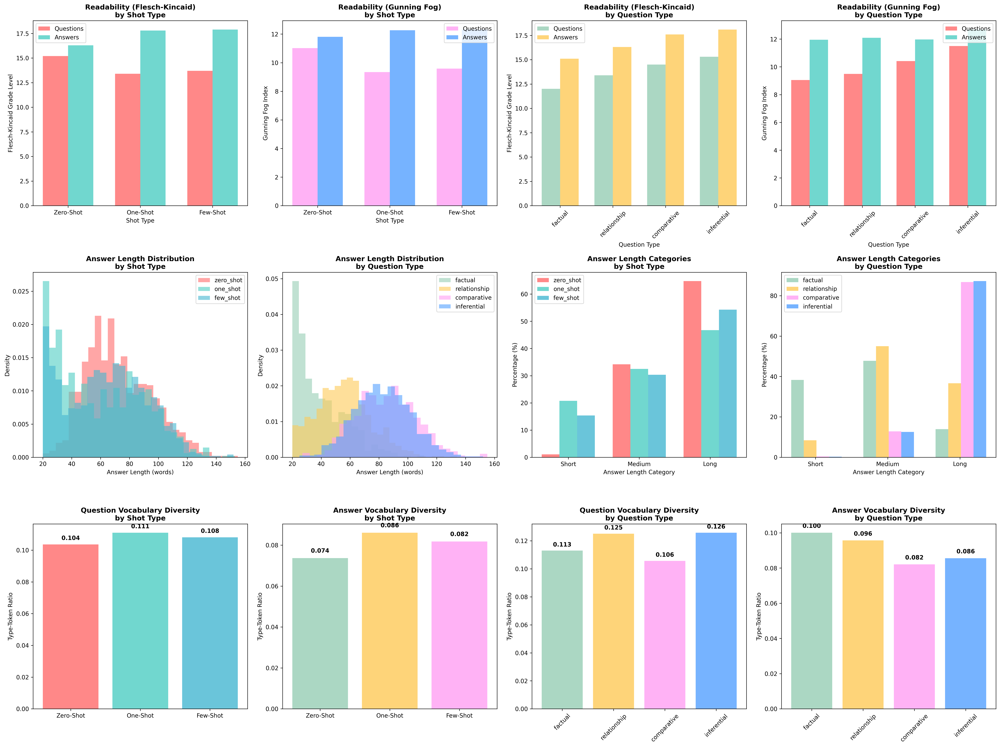

## 📊 Dataset Statistics and Analysis
This module provides a comprehensive statistical analysis of the 3,314 QA pairs generated using the NeuReg framework. The analysis covers readability, length distribution, vocabulary diversity, and sampling patterns across different shot types and question categories.

---
## 📁 Files Overview

| File                                   | Description                                              |
| -------------------------------------- | -------------------------------------------------------- |
| `Statistical_Analysis.ipynb`           | Main notebook to run and visualize all analyses          |
| `QA_Analysis_Complete.png`             | Combined figure summarizing results                      |
| `Cross_Tabulation_Length_Analysis.csv` | Answer length cross-tabulated by shot type/question type |
| `Length_Distribution_Analysis.csv`     | Raw length stats by category                             |
| `Pivot_Table_Length_Analysis.csv`      | Pivot summary of short/medium/long answers               |
| `QA_Analysis.json`                     | JSON-formatted summary statistics                        |
| `Readability_Analysis.csv`             | Flesch-Kincaid and Gunning Fog scores                    |
| `Vocabulary_Diversity_Analysis.csv`    | Type-Token Ratio (TTR) and vocabulary sizes              |

---

## 📦 Dataset Summary
Loaded: Zero-Shot, One-Shot, and Few-Shot datasets

Total QA Pairs: 3,314

📚 Question Types: factual, relationship, comparative, inferential

###  Readability Analysis
Overall

| Item      | Flesch-Kincaid (FK) | Gunning Fog (GF) |
| --------- | ------------------- | ---------------- |
| Questions | 14.1                | 9.28             |
| Answers   | 17.7                | 11.61            |

### By Shot Type

| Shot Type | Q-FK | Q-GF  | A-FK | A-GF  |
| --------- | ---- | ----- | ---- | ----- |
| Zero-Shot | 15.2 | 11.02 | 16.3 | 11.81 |
| One-Shot  | 13.4 | 9.34  | 17.8 | 12.27 |
| Few-Shot  | 13.7 | 9.59  | 17.9 | 12.32 |

###  By Question Type

| Type         | Q-FK | Q-GF  | A-FK | A-GF  |
| ------------ | ---- | ----- | ---- | ----- |
| Factual      | 12.0 | 9.05  | 15.1 | 11.95 |
| Relationship | 13.4 | 9.49  | 16.3 | 12.09 |
| Comparative  | 14.5 | 10.42 | 17.6 | 11.97 |
| Inferential  | 15.3 | 11.50 | 18.1 | 12.69 |

### Answer Length Distribution

| Category    | Short (<30) | Medium (30–60) | Long (>60) |
| ----------- | ----------- | -------------- | ---------- |
| **Overall** | 12.3%       | 32.3%          | 55.4%      |

### By Shot Type

| Shot Type | Short | Medium | Long  |
| --------- | ----- | ------ | ----- |
| Zero-Shot | 1.1%  | 34.2%  | 64.8% |
| One-Shot  | 20.7% | 32.5%  | 46.8% |
| Few-Shot  | 15.4% | 30.4%  | 54.3% |

### By Question Type

| Type         | Short | Medium | Long  |
| ------------ | ----- | ------ | ----- |
| Factual      | 38.3% | 47.8%  | 14.0% |
| Relationship | 8.4%  | 55.0%  | 36.6% |
| Comparative  | 0.4%  | 12.8%  | 86.8% |
| Inferential  | 0.2%  | 12.5%  | 87.2% |

### Vocabulary Diversity (TTR)

| Category     | Questions TTR | Answers TTR |
| ------------ | ------------- | ----------- |
| Overall      | 0.0541        | 0.0400      |
| Zero-Shot    | 0.1036        | 0.0737      |
| One-Shot     | 0.1110        | 0.0861      |
| Few-Shot     | 0.1081        | 0.0818      |
| Factual      | 0.1130        | 0.1001      |
| Relationship | 0.1251        | 0.0957      |
| Comparative  | 0.1057        | 0.0821      |
| Inferential  | 0.1258        | 0.0856      |

### 📊 Visual Summary
You can view the full overview in the following visualization:

