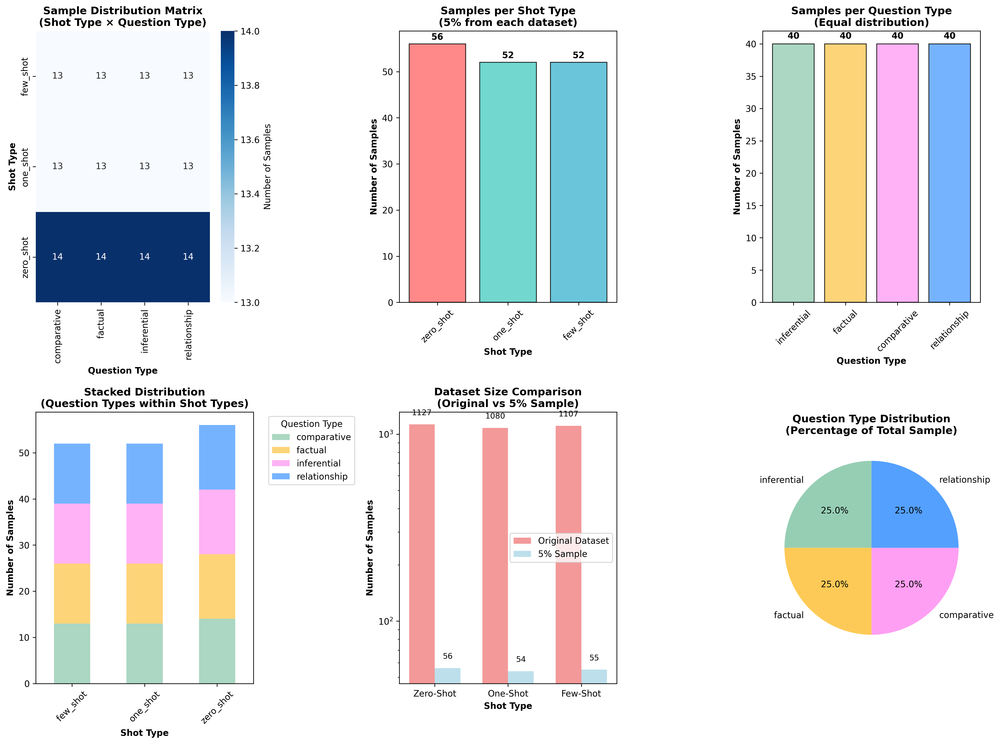

## 🧑‍⚖️ Human Evaluation of QA Pairs
This module documents the manual evaluation of 160 stratified QA pairs rated by 5 human annotators. It provides detailed insights into sampling design, scoring criteria, inter-rater agreement, and performance breakdowns across question and shot types.

---
### 📁 Directory Contents

| File Name                                  | Description                                                 |
| ------------------------------------------ | ----------------------------------------------------------- |
| `Evaluation_Template.md`                   | Evaluation rubric and instructions used by annotators       |
| `QA_Human_Eval_Stratified_5percent.csv`    | Annotated scores from 5 evaluators on 160 QA pairs          |
| `QA_Sampling_Summary_Statistics.csv`       | Metadata and size stats per shot and question type          |
| `QA_Stratified_Sampling_Visualization.png` | Visual breakdown of stratified sampling                     |
| `human results analysis.ipynb`             | Jupyter notebook for computing mean scores, agreement, etc. |
| `human_evaluation_analysis_report.json`    | Serialized summary of evaluation metrics                    |
| `stratified sampling method.ipynb`         | Code for stratified sampling from QA datasets               |

---

### 🧪 QA Sampling Overview

160 QA pairs were stratified sampled (5% per subgroup) from a total of ~3,300 QA pairs based on:

Shot Types: Zero-Shot, One-Shot, Few-Shot

Question Types: Factual, Relationship, Comparative, Inferential

| Shot Type | Question Type | Samples | Source Size | Sample % |
| --------- | ------------- | ------- | ----------- | -------- |
| Zero-Shot | Factual       | 14      | 1127        | 8.8%     |
| Zero-Shot | Relationship  | 14      | 1127        | 8.8%     |
| Zero-Shot | Comparative   | 14      | 1127        | 8.8%     |
| Zero-Shot | Inferential   | 14      | 1127        | 8.8%     |
| One-Shot  | Factual       | 13      | 1080        | 8.1%     |
| One-Shot  | Relationship  | 13      | 1080        | 8.1%     |
| One-Shot  | Comparative   | 13      | 1080        | 8.1%     |
| One-Shot  | Inferential   | 13      | 1080        | 8.1%     |
| Few-Shot  | Factual       | 13      | 1107        | 8.1%     |
| Few-Shot  | Relationship  | 13      | 1107        | 8.1%     |
| Few-Shot  | Comparative   | 13      | 1107        | 8.1%     |
| Few-Shot  | Inferential   | 13      | 1107        | 8.1%     |

[QA_Stratified_Sampling_Visualization.png]

----

###  🧩 Evaluation Overview

| Attribute            | Value                                                    |
| -------------------- | -------------------------------------------------------- |
| Evaluation Type      | Manual (Human)                                           |
| Number of Evaluators | 5                                                        |
| QA Pairs Evaluated   | 160 (×5 = 800 individual scores)                         |
| Total Records Loaded | 10,322                                                   |
| Prompt Types         | Zero-Shot, One-Shot, Few-Shot                            |
| Question Types       | Factual, Relationship, Comparative, Inferential          |
| Metrics              | Relevance, Accuracy, Completeness, Fluency, KG Alignment |

---

###  🎯 Evaluation Metrics (1–5 Scale)

Relevance: Appropriateness of the question to the context

Accuracy: Factual correctness of the answer

Completeness: Coverage of all key information

Fluency: Grammatical quality and readability

KG Alignment: Faithfulness to KG facts

---

### 🔧 Overall Performance Summary

| Metric       | Mean Score | Std Dev | Mean %     |
| ------------ | ---------- | ------- | ---------- |
| Relevance    | 4.85       | 0.40    | 97.04%     |
| Accuracy     | 4.85       | 0.36    | 96.99%     |
| Completeness | 4.77       | 0.44    | 95.34%     |
| Fluency      | 4.79       | 0.42    | 95.85%     |
| KG Alignment | 4.84       | 0.38    | 96.73%     |
| **Overall**  | **4.82**   | 0.26    | **96.39%** |

---

### 🗳️ Majority Vote Agreement

Outcome Type:

| Outcome Type          | QA Pair Count            |
| --------------------- | ------------------------ |
| Full agreement (5/5)  | 80–89 (varies by metric) |
| Majority agreement ≥3 | 150 pairs                |
| No agreement          | 2 pairs                  |

By Metric:

| Metric       | Full Agreement |
| ------------ | -------------- |
| Relevance    | 80             |
| Accuracy     | 89             |
| Completeness | 58             |
| Fluency      | 30             |
| KG Alignment | 84             |

---

### 📊 Performance by Shot Type

| Shot Type | Mean Score | Mean %     |
| --------- | ---------- | ---------- |
| Zero-Shot | 4.82       | 96.42%     |
| One-Shot  | **4.83**   | **96.68%** |
| Few-Shot  | 4.80       | 96.03%     |

---

### 📚 Performance by Question Type

| Question Type | Mean Score | Mean %     |
| ------------- | ---------- | ---------- |
| Inferential   | **4.86**   | **97.13%** |
| Relationship  | 4.82       | 96.50%     |
| Factual       | 4.80       | 95.91%     |
| Comparative   | 4.80       | 96.00%     |

---

### 🔬 Inter-Evaluator Agreement

| Evaluator | Agreement Rate |
| --------- | -------------- |
| Eval\_1   | 72.1%          |
| Eval\_2   | 88.6%          |
| Eval\_3   | 89.3%          |
| Eval\_4   | 84.9%          |
| Eval\_5   | 82.3%          |

