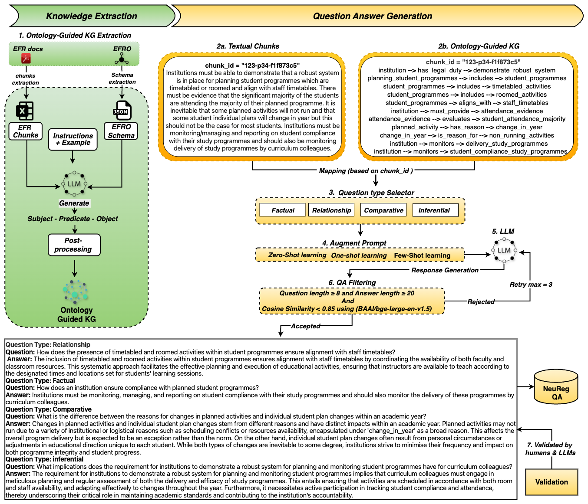

# 🧠 NeuReg: Neuro-Symbolic QA Generation from Regulatory Compliance

**NeuReg** is a neuro-symbolic QA generation framework that transforms complex regulatory documents into intelligent and explainable question–answering systems. It seamlessly integrates ontology-guided knowledge graphs (KGs) and regulatory text chunks to generate high-quality, semantically grounded QA pairs. By combining structured symbolic knowledge from domain ontologies with the contextual richness of unstructured policy text, NeuReg enables accurate, diverse, and interpretable QA generation using large language models (LLMs).

---

## 📚 Table of Contents
- [🔄 Pipeline Overview](#-pipeline-overview)
- [🧠 Model Architecture](#-model-architecture)
- [🚀 Motivation](#-motivation)
- [✨ Key Contributions](#-key-contributions)
- [🎯 QA Generation Types](#-qa-generation-types)
- [📂 Repository Structure](#-repository-structure)
- [⚙️ Installation](#️-installation)
- [▶️ Getting Started](#️-getting-started)
- [📖 Citation](#-citation)
- [📄 License](#-license)

---

## 🔄 Pipeline Overview

NeuReg consists of two main stages: **Knowledge Extraction** and **Question Answer Generation**.

### 1️⃣ Ontology-Guided Knowledge Extraction
- Regulatory text is split into coherent **text chunks**.
- A domain-specific [Educational Funding Regulation Ontology (EFRO)](https://rgu-computing.github.io/EFRO/EFRO/docs/index-en.html) is used to guide **schema extraction** and **triple generation** using GPT-4 turbo.
- Each output triple is structured as **(subject, predicate, object)** with post-processing.

### 2️⃣ Question Answer Generation
Each chunk is mapped to its corresponding KG (based on `chunk_id`). The QA generation follows four steps:

1. **Question Type Selection** – Factual, Relational, Comparative, Inferential  
2. **Prompt Augmentation** – Zero-shot, One-shot, Few-shot prompting strategies  
3. **QA Filtering** – Answer length, semantic similarity (cosine < 0.85), retry up to 3 times  
4. **Validation** – Human annotation and automatic scoring from LLMs

---

## 🧠 Model Architecture



**Figure 1**: *NeuReg: Neuro-symbolic framework for regulatory QA generation using ZS, OS, and FS prompting with ontology-guided KG extraction.*

---

## 🚀 Motivation

Access to education funding is governed by complex and evolving regulations. These policies are often communicated through lengthy documents that are difficult for students and institutional staff to interpret. NeuReg addresses this challenge by transforming unstructured regulatory guidance into structured and explainable QA datasets, bridging the gap between dense policy language and actionable decision support.

---

## ✨ Key Contributions

### 🧠 Neuro-Symbolic QA Generation Framework
We present NeuReg, a neuro-symbolic question–answer generation framework that integrates the generative power of large language models (LLMs) with structured knowledge from ontology-guided knowledge graphs and their aligned regulatory text segments. This hybrid approach enables the generation of high-quality, semantically grounded QA pairs tailored to complex regulatory domains.

### 📊 First-of-Its-Kind Regulatory QA Dataset
We construct a domain-specific QA dataset for regulatory compliance in education funding, encompassing four distinct question types: Factual (FactQ), Relational (RelQ), Comparative (CompQ), and Inferential (InferQ). These QA pairs are generated using multi-strategy prompting and rigorously validated through comparative assessment by expert human annotators and state-of-the-art (SOTA) LLM judges. To the best of our knowledge, this is the first QA dataset of its kind within this domain.

### 🔬 Empirical Validation through Ablation and Fine-Tuning
We conduct controlled ablation studies to quantify the individual contributions of structured KG triples and unstructured text chunks to QA generation quality, demonstrating the indispensable role of symbolic knowledge. Additionally, we evaluate the practical utility of the generated datasets by fine-tuning multiple LLMs (T5, FLAN-T5), analyzing the effects of prompting strategies (ZS, OS, FS) and model scale on QA performance.

---

## 🎯 QA Generation Types

| Type      | Description |
|-----------|-------------|
| **FactQ**   | Extract concrete details (e.g., definitions, thresholds, dates) for grounded information retrieval. |
| **RelQ**    | QExamine entity interactions within regulatory structures, reflecting KG-based links (e.g., between providers and funding authorities). |
| **CompQ**   | Contrast policies, programmes, or entities to highlight distinctions or trade-offs. |
| **InferQ**  | Require synthesis or multi-hop reasoning across text and KG to derive implicit conclusions |

---

## 📂 Repository Structure

```text
NeuReg/
├── README.md                          # Overview of the project, contributions, pipeline, and structure
├── LICENSE                            # Project license (MIT)
├── requirements.txt                   # Python dependencies for reproducing the results

├── data/                              # Preprocessing and knowledge graph construction
│   ├── README.md                      # Overview of chunk & triple-level statistics
│   ├── chunks/                        # Extracting regulatory text chunks
│   │   ├── chunks.csv                 # chunk dataset
│   │   └── chunks.ipynb               # Chunk extraction notebook
│   ├── ontology/                      # Ontology schema and KG triples
│   │   ├── ontology_schema.json       # Extracted ontology schema in JSON
│   │   ├── Ontology_Guided_Triples.csv           # Ontology-guided KG triples
│   │   ├── Ontology_Guided_Triples_statistics.json  # Stats on generated triples
│   │   ├── EFRO_Schema_Extraction.ipynb           # Extract ontology schema from guidance
│   │   └── KG_Extraction.ipynb                    # Generate KG using ontology + chunks

├── qa_generation/                      # QA dataset generation using prompting
│   ├── README.md                      
│   ├── Zero-shot.ipynb                # Zero-shot QA generation
│   ├── One-shot.ipynb                 # One-shot QA generation
│   ├── Few-shot.ipynb                 # Few-shot QA generation
│   ├── Zero-Shot_qa_dataset.json      # Output QA dataset (zero-shot)
│   ├── One-Shot_qa_dataset.json       # Output QA dataset (one-shot)
│   ├── Few-Shot_qa_dataset.json       # Output QA dataset (few-shot)
│   ├── Zero_Shot_QA_analysis_report.json  # Analysis report (zero-shot)
│   ├── One_Shot_QA_analysis_report.json   # Analysis report (one-shot)
│   └── Few_Shot_QA_analysis_report.json   # Analysis report (few-shot)

├── evaluation/                        # Complete evaluation framework
│   ├── README.md                      # Central summary of all evaluation types and modules
│   ├── Ontology-Guided_KG_Evaluation/         # Evaluation of KG triples
│   │   ├── README.md
│   │   ├── Evaluation.ipynb                    # Validates triple structure and semantics
│   │   ├── evaluation_results.csv              # Per-triple validation outcomes
│   │   └── evaluation_report.json              # Aggregate KG validation statistics
│   ├── LLM-as-a-Judge/                        # LLM-based QA evaluation (5 models)
│   │   ├── README.md                          # Overview of LLM evaluation setup and metric definitions
│   │   ├── DeepSeek-R1-Distill-Llama-70B/     # Evaluation results from DeepSeek-R1
│   │   │   ├── DeepSeek-R1-Distill-Llama-70B.ipynb         # ipynb file
│   │   │   ├── DeepSeek_zeroshot_evaluation_results.csv    #  Zero-Shot QA results
│   │   │   ├── DeepSeek_oneshot_evaluation_results.csv     #  One-Shot QA results
│   │   │   └── DeepSeek_fewshot_evaluation_results.csv     #  Few-Shot QA results
│   │   ├── Gemma-2 Instruct 27B/              # ipynb file and evaluation results
│   │   ├── LLaMA 3.3 70B/                     # ipynb file and evaluation results
│   │   ├── mixtral-8x22b-instruct-v0.1/       # ipynb file and evaluation results
│   │   └── Qwen3-32B/                         # ipynb file and evaluation results
Each model folder includes: one `.ipynb` notebook + 3 CSVs for Zero-/One-/Few-Shot QA evaluation results

│   ├── llms results analysis/                 # Cross-model aggregation and statistics
│   │   ├── README.md
│   │   ├── LLM results analysis.ipynb         # Compare results across LLM judges
│   │   └── comprehensive_analysis_report.json # Metrics summary (means, deviations, majority voting agreement)
│   ├── Human Judgements/                      # Human evaluation and sampling
│   │   ├── README.md
│   │   ├── Evaluation_Template.md             # Annotation form and scoring rubric
│   │   ├── stratified sampling method.ipynb   # Script for stratified QA sampling
│   │   ├── QA_Human_Eval_Stratified_5percent.csv     # Final sampled QA set for annotation
│   │   ├── QA_Sampling_Summary_Statistics.csv        # Summary of sampled distribution
│   │   ├── QA_Stratified_Sampling_Visualization.png  # Sample distribution plots
│   │   ├── human results analysis.ipynb       # Human score processing and statistics
│   │   └── human_evaluation_analysis_report.json  # Metrics summary (means, deviations, majority voting agreement)
│   ├── LLM vs Human/                          # Correlation between LLM and human scores
│   │   ├── README.md
│   │   ├── LLM vs Human.ipynb                 # Notebook to compare LLM vs human scores
│   │   └── human_llm_comparison_results.csv   #  EM,f1

├── analysis/                          # Statistical analysis & insights
│   ├── README.md 
│   ├── Statistical_Analysis.ipynb
│   ├── Readability_Analysis.csv       # FKGL, Flesch, etc.
│   ├── Vocabulary_Diversity_Analysis.csv
│   ├── Length_Distribution_Analysis.csv
│   ├── LLMs_based_results_analysis.ipynb
│   └── LLMs_Analysis_report.csv

Ablation Studies/
│
├── Ablation Study 1/
│ ├── chunks_only_qa_dataset.ipynb
│ ├── Ablation_1_chunks_only_analysis_report.json
│ └── Ablation_1_chunks_only_qa_dataset.json
│
├── Ablation Study 2/
│ ├── KG_only_qa_dataset.ipynb
│ ├── Ablation_2_kg_only_analysis_report.json
│ └── Ablation_2_kg_only_qa_dataset.json
│
├── Evaluation/
│ ├── chunks_only_Evaluation/
│ │ ├── DeepSeek-R1-Distill-Llama-70B/
│ │ ├── Gemma-2 Instruct (27B)/
│ │ ├── Llama 3.3 70B/
│ │ ├── mixtral-8x22b-instruct-v0.1/
│ │ └── Qwen3-32B/
│ │
│ └── KG_only_Evaluation/
│  ├── DeepSeek-R1-Distill-Llama-70B/
│  ├── Gemma-2 Instruct (27B)/
│  ├── Llama 3.3 70B/
│  ├── mixtral-8x22b-instruct-v0.1/
│  └── Qwen3-32B/
│
└── Results Analysis/
├── Chunks Only/
│ └── Chunks Only Evaluation Analysis.ipynb
└── KG Only/
 └── KG Only Evaluation Analysis.ipynb

├── fine_tuning/                       # Fine-tuning experiments on QA datasets
│   ├── README.md 
│   ├── t5_small/
│   ├── t5_base/
│   ├── t5_large/
│   ├── flan_t5_small/
│   ├── flan_t5_base/
│   └── flan_t5_large/                      #  results 
```
---

## ⚙️ Installation

```bash
git clone https://github.com/RGU-Computing/NeuReg.git
cd NeuReg
pip install -r requirements.txt
```
---

## ▶️ Getting Started

To reproduce the NeuReg QA generation pipeline:

### **Step 1: Preprocess Regulatory Text**
```bash
cd data/chunks/
jupyter notebook chunks.ipynb
```

### **Step 2: Generate Ontology-Guided KG Triples**
```bash
cd data/ontology/
jupyter notebook EFRO_Schema_Extraction.ipynb  # Extract EFRO ontology
jupyter notebook KG_Extraction.ipynb           # Generate KG triples
```

### **Step 3: Generate QA Pairs**
Choose your prompting strategy:
```bash
cd qa_generation/
# Choose one of the following:
jupyter notebook Zero-shot.ipynb   # Zero-shot prompting
jupyter notebook One-shot.ipynb    # One-shot prompting  
jupyter notebook Few-shot.ipynb    # Few-shot prompting
```

### **Step 4: Evaluate QA Quality**
```bash
cd evaluation/llm_judges/[ModelName]/
# Example:
cd evaluation/llm_judges/DeepSeek-R1-Distill-Llama-70B/
jupyter notebook DeepSeek-R1-Distill-Llama-70B.ipynb
```

### **Step 5 (Optional): Analyze LLM vs Human Agreement**
```bash
cd evaluation/llm_vs_human/
jupyter notebook llm_vs_human_Analysis_results_analysis.ipynb
```

### **Step 6 : Fine-tune Models**
```bash
cd fine_tuning/t5_small/  # or flan_t5_base/, flan_t5_large/, etc.
# Choose based on your dataset:
jupyter notebook t5_small_zero.ipynb   # Zero-shot dataset
jupyter notebook t5_small_one.ipynb    # One-shot dataset
jupyter notebook t5_small_few.ipynb    # Few-shot dataset
```
---

### 📖 Citation


Arshad, U., Corsar, D., & Nkisi-Orji, I. (2025). *NeuReg: Neuro-Symbolic QA Generation from Regulatory Compliance*. In Proceedings of the 13th Knowledge Capture Conference (K-CAP ’25), 232–235. https://doi.org/10.1145/3731443.3771375

GitHub Repository: https://github.com/RGU-Computing/NeuReg

---

## 📄 License

This project is licensed under the MIT License. © 2025 School of Computing, Engineering and Technology, Robert Gordon University, UK.
For full license details, see the [LICENSE](LICENSE) file.
